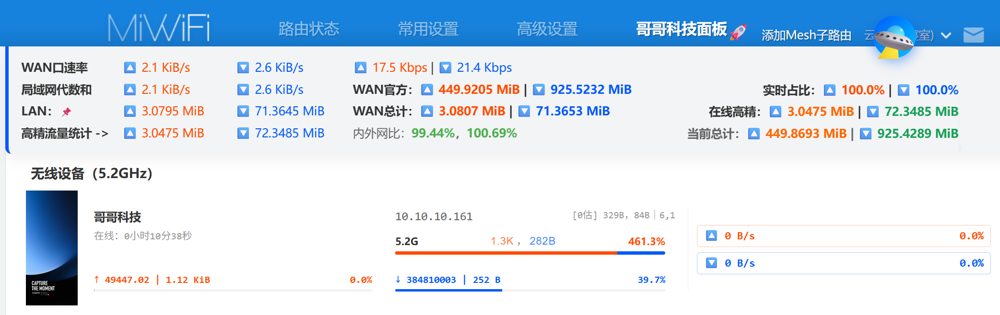
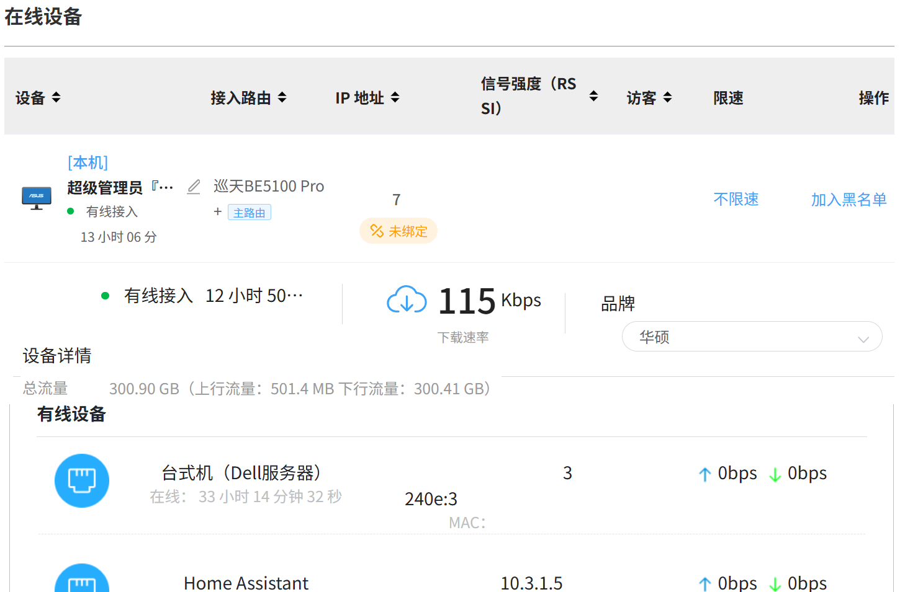

# Mi-Stat_Max @ 哥哥科技

[](https://github.com/ucxn/Mi-Stat_Max)&emsp;&nbsp;
[](https://www.gnu.org/licenses/agpl-3.0.html)&nbsp;&emsp;
[](https://scriptcat.org/zh-CN)&nbsp;&emsp;
[](https://github.com/ucxn/ZTE-Stat_HA)

[English](README.md) | **简体中文**

**Mi-Stat_Max**是 **Bro-Stat_Max 系列**最重要的分支之一，一款专为小米路由器 Web 管理后台定制的 “油猴” 增强脚本插件 + HA 全屋智能家居接入集成，作者：*哥哥科技* ！

支持 MiRD全系路由器，小米BE3600、BE6500（含Pro）、万兆、BE5000、BE7000、AX6000等各型号！

**支持检测**：WAN口总流量（3s刷新）、各设备速率（3s）、各设备开机以来官方流量小计，随时读档。双网默认为加和，并非有意设计。</br>
**支持计算**：WAN口速率（从流量微分求导）、各设备流量（∫积分）+官方统计双轨制对比！即开即用！</br>
**统计口径**：同时支持对比：官方值（只含本次接入）、当前在线、网页打开以来的总计。</br>
**特色功能**：内外网比，3数据源综合裁决；事件驱动流量计算；更快地显示WAN真值速率；单位换算&统一；打开就有统计数据，无需挂机监控。</br>
**视觉UI**：含设备名、在线时间、IPv4、接入端口，高精上下行和比例（双色雷达），历史上行、本次下行占全家比例（独立红蓝进度条），网速赛跑条。

本脚本通过自建面板重构了“组网管理”与“接入设备”页面的 UI 布局。引入了梯形积分算法、异常流量雷达以及双轨制流量对齐显示，为网络工程人员和进阶玩家提供。理论支持小米全系 WiFi6/7 路由器。

路由器Web UI增强 × 米家探测联动接入，Home Assistant 插件集成、UI增强，米家伴侣，支持全系MiWiFi！统计流量，查看占比速率、上下行比值，打击P2P偷上行，支持1000/1024进制，支持Mbps/GiB，可统计内网和公网作对比！设备列表平铺化，大屏可视化一点通，你所要的，都在这里，无需频繁切换页面…

## [点击一键安装](https://github.com/ucxn/Mi-Stat_Max/blob/main/README_zh-Hans.md#%E8%84%9A%E6%9C%AC%E5%AE%89%E8%A3%85)&emsp;&nbsp;&emsp;[](https://www.bilibili.com/video/BV1LZ6yBXESq)

[**国内用户**](https://scriptcat.org/zh-CN/script-show-page/6592)&nbsp;&nbsp;&nbsp;&nbsp;&nbsp;**[国际用户](https://greasyfork.org/zh-CN/scripts/582042)**

官方 Web 后台虽然稳定，但在数据展示的交互设计上存在一些不便。例如，实时的网速数据和设备历史累积流量被隐藏在了二级菜单中，需要频繁点击具体设备才能查看，无法在全局列表形成直观的对比。本插件的核心目的就是“拍平”这些层级。将单台设备的上下行网速、本次在线期间的积分流量，以及底层的累积总吞吐量，全部提取并前置到主设备列表中，无需任何多余的操作，所有设备的网络吞吐状态一目了然。

## ✨ 功能特性 (Features)

* **🏠 联动 Home Assistant**：搭配专属的 哥哥科技 中枢集成，支持通过 Webhook 将状态实时推送到 HACS 插件。避免Web只能单端接入，实现多端并发观测。详见兄弟项目（通用）：[Mi-Stat_HA](https://github.com/ucxn/ZTE-Stat_HA)
* **流量与占比统计**：分别统计单设备的上下行流量，实时查看流量占比速率及上下行、内外网比值。
* **异常上传监控**：支持检测上下行比例，直观标记异常上传，打击 PCDN / P2P 偷跑上行。
* **精准单位换算**：严格区分网络传输速率与存储容量，支持 1000/1024 双进制，支持 Mbps / GiB 显示。
* **全局数据对比**：支持内网（局域网代数和）与公网（WAN口）数据大盘统计与直观对比。
* **高精积分流量统计 ⏱️  UI 栅格重构 🖥️**：完美支持手机端

* **双轨制流量统计对比**：除展示路由器接口自带的历史总吞吐量外，还会在页面前端独立进行高频的数据采样，统计设备在当前页面打开期间的真实流量消耗。两者并排显示，互为参考。单位统一成本次，注重变化的观察。
* **自定义支持**：尊重网络工程习惯，支持通过脚本变量自定义 1000 进制 Mbps、1024 进制 MiB/s 显示逻辑。
* **🛡️ 隐私保护、UI 优化**：
  * DOM 原地突变（Mutation）渲染时，自动覆写敏感的 MAC 地址与 IPv6 临时地址，确保在录屏、截屏及分享网络状态时的安全。
  * 基于 Flexbox 的强制底部对齐系统，修复栅格导致的高度差问题。
  * 无痕注入，不破坏原生 Vue 状态机，保障浏览器运行性能。
* **:rainbow: 事件驱动**：优化微积分算法，避免采样时间不对齐或相位差导致误算流量面积。以网络速率变化为采样区间基准。

## 📸 界面预览 (Screenshots)

| 小米普通插件|中兴插件参考 | 本插件 |
| :---: | :---: | :---: |
|  |  |  |


## 🚀 安装指南 (Installation)

### 环境要求
在使用本脚本之前，请确保您的浏览器已安装用户脚本管理器扩展，例如：
* **篡改猴   [Tampermonkey](https://www.tampermonkey.net)**  (推荐, 支持 Chrome, Edge, Firefox, Safari)
* **暴力猴   [Violentmonkey](https://violentmonkey.github.io)**
* **油猴子   [Greasemonkey](https://www.greasespot.net)**

### 脚本安装
1.  点击此处安装全面版Mi-Stat_Max：

    [从GitHub安装](https://github.com/ucxn/Mi-Stat_Max/releases/latest)&nbsp;&nbsp;&nbsp;&nbsp;&nbsp;&nbsp;[从GreasyFork安装](https://greasyfork.org/zh-CN/scripts/582042)&nbsp;&nbsp;&nbsp;&nbsp;&nbsp;&nbsp;[从OpenUserJS自动更新](https://openuserjs.org/scripts/%E5%93%A5%E5%93%A5%E7%A7%91%E6%8A%80)

    [通过 ScriptCat 脚本猫 安装（直连推荐：**无需科学上网**）](https://scriptcat.org/zh-CN/script-show-page/6592)更新推送

全面更新兄弟项目，接入智能集成&nbsp;⇨&nbsp;<a href="https://github.com/ucxn/ZTE-Stat_HA" target="_blank"></a>&nbsp;&nbsp;&nbsp;<a href="https://www.bilibili.com/video/BV1PtR7B8ECC" target="_blank"></a>
    
2.  在弹出的安装界面中点击 **“安装”** 或 **“更新”**。
3.  登录您的小米路由器 Web 管理后台，*输入管理员密码*，登录成功后 *刷新网页* ,进入“哥哥科技面板”界面，脚本将自动生效。
    
> [!IMPORTANT]
 *备用唤醒入口*：若不生效，请检查**左侧工具边栏导航**，找到 **🚀 哥哥科技面板** 点开进行使用，效果基本一致。<br><br>请确保 **篡改猴** 插件运行正常！！也就是 浏览器 拓展图标这里，正常显示数字！允许用户脚本注入教程如下图。

> [!NOTE]
> 移动端  **Via** 浏览器 脚本/插件 *功能无法生效*？
> <details>
> <summary>👉 点此展开查看解决办法</summary>
> <br>由于 Via 浏览器的内核机制限制，默认的 `document-idle` 无法成功注入。<br>
> <br>请进入 Via 的脚本管理界面，将运行时期修改为 `document-start`或`document-end` 均可。<br>
> 
> 
> </details>

> [!TIP]
> 若脚本仍未生效，请使用如下教程：


#### 🔗 Symlinks 友情链接

[](https://github.com/ucxn/ZTE-Stat_HA)
[](https://github.com/ucxn/Ban-PCDN_Anti-P2P)

## ⚙️ 个性化配置 (Configuration)

脚本顶部暴露了全局环境变量 `CONFIG` 对象，支持用户根据自身网络环境进行微调：

```javascript
const CONFIG = {
    calcMode: 1,            // 1: 绝对倍数模式 (上行/下行), 0: 传统占比模式
    ratioExtremeUp: 10,     // 极端上传触发阈值 (默认 1000%，触发红色⚠️告警)
    ratioWarnUp: 0.07,      // 重度上传触发阈值 (默认 7%，触发红色高亮)
    ratioExtremeDown: 0.01, // 极端下载触发阈值 (默认 1%，触发蓝色下载倍数显示)
    
    // 物理端口与无线频段中文映射字典 (可根据你的具体路由型号增删)
    portMap: {
        "eth1": "端口 1",
        "eth2": "端口 2",
        "eth3": "端口 3",
        "eth4": "端口 4",
        "wl0":  "Wi-Fi 2.4G",
        "wl1":  "Wi-Fi 5.2G",
        "wl2":  "Wi-Fi 5.8G"
    }
};
```

## ⚠️ 注意事项 (Notes)

* 本脚本仅在前端对获取到的 API 数据进行重新排版与计算，不会修改路由器底层的核心配置。
* 本脚本属于纯前端数据重组工具，不涉及对小米路由器底层固件的修改。

## 📄 协议 (License)

[GNU-Affero GPL 3.0](https://www.gnu.org/licenses/agpl-3.0.html)

---
*Authored by 哥哥科技*
[](https://star-history.com/#ucxn/Mi-Stat_Max&Date)
